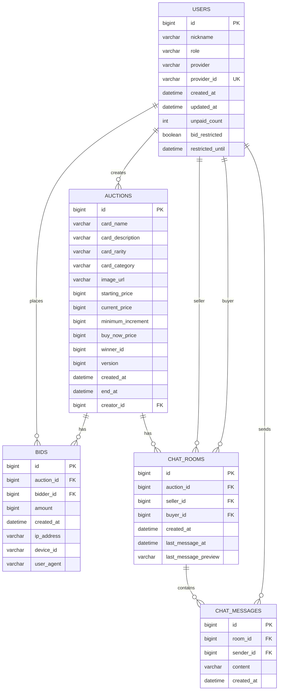

# CardBid 프로젝트 명세서

트레이딩 카드, 스포츠 카드, 그레이딩 카드, 한정판 카드를 경매 방식으로 거래하는 모바일 앱입니다.  
카카오 로그인, 경매 등록/입찰/즉시 낙찰, 카테고리 기반 탐색, 구매자-판매자 1:1 채팅, MY 활동 관리, 관리자 안전장치 기능을 제공합니다.

---

## 1. 프로젝트 개요

### 서비스 목적

카드 거래에서 필요한 상품 탐색, 경매 입찰, 판매자 문의, 낙찰 관리를 하나의 앱 안에서 처리할 수 있도록 만든 경매형 마켓 서비스입니다.

### 핵심 사용자

| 사용자 | 주요 목적 |
| --- | --- |
| 구매자 | 원하는 카드를 검색하고 경매에 입찰하거나 즉시 낙찰 |
| 판매자 | 카드를 등록하고 구매자와 채팅으로 거래 조건 확인 |
| 관리자 | 의심 입찰 패턴 확인, 미결제 사용자 제한 |

### 주요 기능 요약

| 구분 | 기능 |
| --- | --- |
| 인증 | 카카오 OAuth 로그인, JWT Access Token/Refresh Token 발급 |
| 홈 | 검색, 카테고리 필터, 진행중 경매 카드 그리드 |
| 탐색 | 카테고리, 검색어, 정렬, 즉시 낙찰/마감 임박 필터 |
| 경매 | 경매 등록, 상세 조회, 입찰, 즉시 낙찰 |
| 채팅 | 경매별 구매자-판매자 1:1 채팅방, WebSocket 실시간 메시지 |
| MY | 내 입찰 내역, 내가 올린 판매글, 내 정보 관리 |
| 관리자 | 의심 입찰 탐지, 미결제 사용자 제재 |

---

## 2. 기술 스택

### Frontend / Mobile

| 기술 | 사용 목적 |
| --- | --- |
| Expo 54 | React Native 앱 개발 및 웹 실행 환경 |
| React 19 | UI 컴포넌트 구성 |
| React Native 0.81 | 모바일 UI 구현 |
| Expo Router 6 | 파일 기반 라우팅, 탭 네비게이션 |
| React Navigation Bottom Tabs | 하단 탭 네비게이션 |
| Axios | REST API 통신 |
| Expo Auth Session | 카카오 OAuth 인증 플로우 |
| Expo Secure Store | 네이티브 환경 토큰 저장 |
| localStorage | 웹 환경 토큰 저장 |
| Expo Image | 카드 이미지 렌더링 |
| Ionicons / Expo Vector Icons | 앱 아이콘 |
| TypeScript | 정적 타입 검사 |
| ESLint / Expo Lint | 코드 품질 검사 |

### Backend

| 기술 | 사용 목적 |
| --- | --- |
| Java 17 | 백엔드 서버 언어 |
| Spring Boot 3.5 | API 서버 프레임워크 |
| Spring Web | REST API 구현 |
| Spring Security | Stateless 보안 설정 |
| Spring Data JPA | ORM 및 Repository |
| Hibernate | JPA 구현체 |
| Spring Validation | Request 검증 |
| Spring WebSocket | 실시간 채팅 |
| JJWT 0.12 | JWT 발급 및 검증 |
| Lombok | DTO/Entity 보일러플레이트 축소 |
| RestTemplate | 카카오 API 호출 |
| PostgreSQL | 운영/로컬 기본 DB |
| H2 | 테스트용 인메모리 DB |
| Gradle | 빌드 및 의존성 관리 |
| JUnit Platform | 백엔드 테스트 |

### Infra / Config

| 항목 | 내용 |
| --- | --- |
| API 서버 포트 | `8080` |
| DB | `jdbc:postgresql://localhost:5432/poke_auction` |
| CORS | 전체 Origin/Header/Method 허용 |
| 인증 방식 | `Authorization: Bearer {accessToken}` |
| WebSocket | `/ws/chat?token={accessToken}` |
| 환경변수 파일 | `.env` 사용, Git 커밋 제외 |

---

## 3. 화면 및 기능 명세

### 3.1 로그인

| 항목 | 내용 |
| --- | --- |
| 기능명 | 카카오 로그인 |
| 설명 | 카카오 OAuth 인가 코드를 백엔드로 전달해 JWT를 발급받음 |
| 주요 동작 | 카카오 인증 요청 → 인가 코드 수신 → `/api/auth/kakao` 호출 → 토큰 저장 |
| 저장 정보 | `accessToken`, `refreshToken`, `userId`, `nickname` |

### 3.2 홈

| 항목 | 내용 |
| --- | --- |
| 기능명 | 경매 홈 |
| 설명 | 앱 진입 후 진행중인 경매를 빠르게 탐색하는 메인 화면 |
| 주요 기능 | 카드 검색, 카테고리 필터, 진행중 경매 그리드, 탐색/등록/MY 빠른 이동 |
| 표시 정보 | 사용자 닉네임, 진행중 경매 수, 24시간 내 마감 수, 카드명, 현재가, 입찰 수, 남은 시간 |

### 3.3 탐색

| 항목 | 내용 |
| --- | --- |
| 기능명 | 경매 탐색 |
| 설명 | 전체 경매를 조건별로 검색하고 정렬 |
| 필터 | 카테고리, 검색어, 즉시 낙찰 가능, 24시간 내 마감 |
| 정렬 | 인기순, 마감 임박, 최신순, 낮은 가격 |
| 이동 | 카드 선택 시 경매 상세 화면 이동 |

### 3.4 경매 상세

| 항목 | 내용 |
| --- | --- |
| 기능명 | 경매 상세/입찰 |
| 설명 | 카드 상세 정보와 현재가를 확인하고 입찰 또는 즉시 낙찰 |
| 주요 기능 | 빠른 입찰 금액 선택, 직접 입찰 금액 입력, 즉시 낙찰, 판매자 문의, 공유 |
| 검증 | 로그인 필요, 최소 입찰가 이상, 본인 경매 입찰 불가 |

### 3.5 판매 등록

| 항목 | 내용 |
| --- | --- |
| 기능명 | 경매 등록 |
| 설명 | 판매자가 카드를 경매 상품으로 등록 |
| 입력값 | 카드명, 설명, 희귀도, 카테고리, 이미지 URL, 상태, 언어, 시작가, 입찰 단위, 즉시 낙찰가, 경매 기간 |
| 프리셋 | 시작가, 입찰 단위, 경매 기간 |
| 검증 | 카드명 필수, 시작가/입찰 단위/기간 1 이상, 즉시 낙찰가는 시작가보다 커야 함 |

### 3.6 채팅

| 항목 | 내용 |
| --- | --- |
| 기능명 | 구매자-판매자 1:1 채팅 |
| 설명 | 특정 경매 상품 기준으로 판매자와 구매자가 대화 |
| REST 기능 | 채팅방 생성/조회, 내 채팅방 목록, 메시지 내역 조회 |
| WebSocket 기능 | 채팅방 JOIN, 메시지 SEND, 실시간 MESSAGE 수신 |
| 접근 제한 | 채팅방 참여자만 메시지 조회/전송 가능 |

### 3.7 MY

| 항목 | 내용 |
| --- | --- |
| 기능명 | 내 활동 관리 |
| 설명 | 입찰/판매/계정 정보를 한 화면에서 관리 |
| 탭 | 내 입찰, 내 판매글, 내 정보 |
| 주요 기능 | 진행 입찰 수, 판매중 수, 낙찰 수, 내 경매 목록, 로그아웃 |

### 3.8 관리자

| 항목 | 내용 |
| --- | --- |
| 기능명 | 안전거래 관리자 기능 |
| 설명 | 이상 거래 및 미결제 사용자를 관리 |
| 주요 기능 | 의심 입찰 패턴 조회, 미결제 사용자 카운트 증가 및 입찰 제한 |
| 접근 제한 | `role = ADMIN` 사용자만 가능 |

---

## 4. API 명세

### 공통 규칙

| 항목 | 내용 |
| --- | --- |
| Base URL | `http://localhost:8080` |
| 인증 헤더 | `Authorization: Bearer {accessToken}` |
| Content-Type | `application/json` |
| 인증 실패 | `401 Unauthorized` |
| 권한 실패 | `403 Forbidden` |
| 요청 검증 실패 | `400 Bad Request` |

### 4.1 Auth API

#### POST `/api/auth/kakao`

카카오 OAuth 인가 코드를 백엔드로 전달해 서비스 JWT를 발급합니다.

Request

```json
{
  "code": "kakao_authorization_code",
  "redirectUri": "http://localhost:19008/login"
}
```

Response

```json
{
  "accessToken": "jwt-access-token",
  "refreshToken": "jwt-refresh-token",
  "userId": 1,
  "nickname": "테스트유저",
  "isNewUser": false
}
```

---

### 4.2 Auction API

#### GET `/api/auctions`

진행중인 경매 목록을 조회합니다.

Query Parameters

| 이름 | 타입 | 필수 | 설명 |
| --- | --- | --- | --- |
| category | string | N | `ALL`, `SINGLE`, `SEALED`, `GRADED`, `PROMO` |
| sort | string | N | `hot`, `ending`, `new`, `cheap` |
| activeOnly | boolean | N | 기본값 `true` |

Response

```json
[
  {
    "id": 1,
    "cardName": "2024 프리즘 루키 카드",
    "cardDescription": "상태: 민트\n언어: 일본어",
    "cardRarity": "SAR",
    "cardCategory": "GRADED",
    "imageUrl": "https://...",
    "startingPrice": 5000,
    "currentPrice": 8000,
    "minimumIncrement": 1000,
    "buyNowPrice": 30000,
    "active": true,
    "endAt": "2026-05-24T12:00:00",
    "createdAt": "2026-05-21T12:00:00",
    "creatorId": 1,
    "creatorNickname": "판매자",
    "bidCount": 2,
    "winnerId": null,
    "bids": []
  }
]
```

#### POST `/api/auctions`

새 경매를 등록합니다.

Auth: 필요

Request

```json
{
  "cardName": "2024 프리즘 루키 카드",
  "cardDescription": "상태: 민트\n언어: 일본어\n하자 없음",
  "cardRarity": "SAR",
  "cardCategory": "GRADED",
  "imageUrl": "https://...",
  "startingPrice": 5000,
  "minimumIncrement": 1000,
  "buyNowPrice": 30000,
  "durationHours": 72
}
```

Validation

| 필드 | 규칙 |
| --- | --- |
| cardName | 필수 |
| startingPrice | 필수, 1 이상 |
| minimumIncrement | 필수, 1 이상 |
| durationHours | 필수, 1 이상 |
| buyNowPrice | 입력 시 시작가보다 커야 함 |

#### GET `/api/auctions/{id}`

경매 상세 정보를 조회합니다.

Response: `AuctionResponse`

#### POST `/api/auctions/{id}/bid`

경매에 입찰합니다.

Auth: 필요

Request

```json
{
  "amount": 9000
}
```

주요 정책

| 정책 | 설명 |
| --- | --- |
| 경매 상태 | 종료된 경매에는 입찰 불가 |
| 입찰 금액 | 현재가보다 커야 함 |
| 최소 단위 | 현재가 + 최소 입찰 단위 이상 |
| 본인 상품 | 자신이 등록한 경매에는 입찰 불가 |
| 제한 사용자 | 입찰 제한 상태면 입찰 불가 |

#### POST `/api/auctions/{id}/buy-now`

즉시 낙찰합니다.

Auth: 필요

정책

| 정책 | 설명 |
| --- | --- |
| buyNowPrice | 즉시 낙찰가가 설정된 상품만 가능 |
| 낙찰 처리 | 현재가를 즉시 낙찰가로 변경하고 경매 종료 |
| winnerId | 구매자 ID로 설정 |

#### GET `/api/auctions/my-bids`

내가 입찰한 경매 목록을 조회합니다.

Auth: 필요

#### GET `/api/auctions/my-listings`

내가 등록한 판매글 목록을 조회합니다.

Auth: 필요

---

### 4.3 Chat API

#### POST `/api/chats/auctions/{auctionId}/rooms`

특정 경매의 1:1 채팅방을 생성하거나 기존 채팅방을 반환합니다.

Auth: 필요

Response

```json
{
  "id": 1,
  "auctionId": 10,
  "auctionCardName": "2024 프리즘 루키 카드",
  "auctionImageUrl": "https://...",
  "sellerId": 1,
  "buyerId": 2,
  "otherUserId": 1,
  "otherUserNickname": "판매자",
  "lastMessagePreview": "상태 문의드립니다",
  "lastMessageAt": "2026-05-21T12:00:00"
}
```

#### GET `/api/chats/rooms`

내 채팅방 목록을 조회합니다.

Auth: 필요

#### GET `/api/chats/rooms/{roomId}/messages`

채팅 메시지 내역을 조회합니다.

Auth: 필요

Response

```json
[
  {
    "id": 1,
    "roomId": 1,
    "senderId": 2,
    "senderNickname": "구매자",
    "content": "상태 문의드립니다.",
    "createdAt": "2026-05-21T12:00:00"
  }
]
```

---

### 4.4 WebSocket API

#### Connect

```text
WS /ws/chat?token={accessToken}
```

연결 시 토큰이 없거나 유효하지 않으면 연결이 종료됩니다.

#### JOIN

```json
{
  "type": "JOIN",
  "roomId": 1
}
```

Response

```json
{
  "type": "JOINED",
  "roomId": 1
}
```

#### SEND

```json
{
  "type": "SEND",
  "roomId": 1,
  "content": "안녕하세요. 카드 상태 문의드립니다."
}
```

Broadcast Response

```json
{
  "type": "MESSAGE",
  "message": {
    "id": 10,
    "roomId": 1,
    "senderId": 2,
    "senderNickname": "구매자",
    "content": "안녕하세요. 카드 상태 문의드립니다.",
    "createdAt": "2026-05-21T12:00:00"
  }
}
```

Error Response

```json
{
  "type": "ERROR",
  "error": "채팅방 정보가 필요합니다."
}
```

---

### 4.5 Admin API

#### GET `/api/admin/suspicious`

의심 입찰 패턴 목록을 조회합니다.

Auth: 필요, ADMIN 권한 필요

Response

```json
[
  {
    "sellerId": 1,
    "bidderId": 2,
    "bidCount": 5,
    "reason": "Multiple bids on same seller's auctions: 5 bids"
  }
]
```

#### POST `/api/admin/unpaid/{userId}`

미결제 사용자 카운트를 증가시키고, 조건에 따라 입찰 제한을 적용합니다.

Auth: 필요, ADMIN 권한 필요

---

### 4.6 Dev API

개발 편의를 위한 API입니다. 운영 환경에서는 비활성화하거나 접근 제한이 필요합니다.

| Method | Path | 설명 |
| --- | --- | --- |
| GET | `/api/dev/token/{userId}` | 특정 userId의 Access Token 발급 |
| POST | `/api/dev/login` | 로컬 테스트 유저 생성/로그인 |

---

### 4.7 Health API

| Method | Path | 설명 |
| --- | --- | --- |
| GET | `/api/health` | 서버 상태 확인 |

---

## 5. 데이터 모델 / ERD

### Mermaid ERD



### 테이블 상세

#### users

| 컬럼 | 타입 | 설명 |
| --- | --- | --- |
| id | Long | PK |
| nickname | String | 사용자 닉네임 |
| role | String | `USER`, `ADMIN`, `BANNED` |
| provider | String | OAuth 제공자, 예: `KAKAO`, `DEV` |
| providerId | String | OAuth 제공자 사용자 ID |
| createdAt | LocalDateTime | 생성일 |
| updatedAt | LocalDateTime | 수정일 |
| unpaidCount | int | 미결제 횟수 |
| bidRestricted | boolean | 입찰 제한 여부 |
| restrictedUntil | LocalDateTime | 입찰 제한 종료 시각 |

제약조건

| 제약 | 설명 |
| --- | --- |
| Unique | `(provider, provider_id)` |

#### auctions

| 컬럼 | 타입 | 설명 |
| --- | --- | --- |
| id | Long | PK |
| cardName | String | 카드명 |
| cardDescription | String | 카드 설명 |
| cardRarity | String | 희귀도 |
| cardCategory | String | 카테고리 |
| imageUrl | String | 카드 이미지 URL |
| startingPrice | Long | 시작가 |
| currentPrice | Long | 현재가 |
| minimumIncrement | Long | 최소 입찰 단위 |
| buyNowPrice | Long | 즉시 낙찰가 |
| winnerId | Long | 낙찰자 ID |
| version | Long | 낙관적 락 버전 |
| createdAt | LocalDateTime | 등록일 |
| endAt | LocalDateTime | 종료 예정 시각 |
| creatorId | Long | 판매자 FK |

#### bids

| 컬럼 | 타입 | 설명 |
| --- | --- | --- |
| id | Long | PK |
| auctionId | Long | 경매 FK |
| bidderId | Long | 입찰자 FK |
| amount | Long | 입찰 금액 |
| createdAt | LocalDateTime | 입찰 시각 |
| ipAddress | String | 입찰자 IP |
| deviceId | String | 디바이스 ID |
| userAgent | String | User-Agent |

#### chat_rooms

| 컬럼 | 타입 | 설명 |
| --- | --- | --- |
| id | Long | PK |
| auctionId | Long | 경매 FK |
| sellerId | Long | 판매자 FK |
| buyerId | Long | 구매자 FK |
| createdAt | LocalDateTime | 생성 시각 |
| lastMessageAt | LocalDateTime | 마지막 메시지 시각 |
| lastMessagePreview | String | 마지막 메시지 미리보기 |

제약조건

| 제약 | 설명 |
| --- | --- |
| Unique | `(auction_id, buyer_id)` |

#### chat_messages

| 컬럼 | 타입 | 설명 |
| --- | --- | --- |
| id | Long | PK |
| roomId | Long | 채팅방 FK |
| senderId | Long | 발신자 FK |
| content | String | 메시지 내용, 최대 1000자 |
| createdAt | LocalDateTime | 발신 시각 |

---

## 6. 주요 비즈니스 정책

### 경매 상태

| 정책 | 설명 |
| --- | --- |
| 진행중 판단 | `endAt`이 현재 시간보다 미래면 진행중 |
| 즉시 낙찰 | `buyNowPrice`가 있고 0보다 크면 가능 |
| 자동 낙찰자 확정 | 스케줄러가 종료된 경매 중 낙찰자가 없는 경매를 확인하고 최고 입찰자를 `winnerId`로 설정 |

### 입찰 정책

| 정책 | 설명 |
| --- | --- |
| 최소 입찰 | `currentPrice + minimumIncrement` 이상이어야 함 |
| 본인 입찰 방지 | 경매 등록자와 입찰자 ID가 같으면 거부 |
| 제한 사용자 방지 | `bidRestricted` 또는 `role = BANNED` 상태면 입찰 거부 |
| 동시성 | `Auction.version`과 `findByIdForUpdate` 기반으로 경매 입찰 경쟁 상태 대응 |

### 채팅 정책

| 정책 | 설명 |
| --- | --- |
| 채팅방 기준 | 경매 1개 + 구매자 1명 기준으로 채팅방 1개 |
| 참여자 | 판매자와 구매자만 참여 가능 |
| 실시간 메시지 | WebSocket 방 참여 세션에 브로드캐스트 |
| 메시지 저장 | WebSocket SEND 시 DB에 저장 후 브로드캐스트 |

---

## 7. 환경 변수

### Backend `.env`

| 이름 | 설명 |
| --- | --- |
| `KAKAO_REST_API_KEY` | 카카오 REST API 키 |
| `KAKAO_CLIENT_SECRET` | 카카오 Client Secret |
| `JWT_SECRET_KEY` | JWT 서명 키 |

### Mobile `.env`

| 이름 | 설명 |
| --- | --- |
| `EXPO_PUBLIC_KAKAO_APP_ID` | 카카오 앱 키 |
| `EXPO_PUBLIC_KAKAO_REDIRECT_URI` | 카카오 Redirect URI |
| `EXPO_PUBLIC_BACKEND_URL` | 백엔드 API URL |

주의: `.env` 파일은 민감 정보가 포함되므로 Git에 커밋하지 않습니다.

---

## 8. 실행 방법

### Backend

```bash
cd backend/auction-api
./gradlew bootRun
```

### Mobile Web

```bash
cd apps/mobile
npm install
npm run web
```

### 검증

```bash
cd apps/mobile
npm run lint
npx tsc --noEmit
```

```bash
cd backend/auction-api
./gradlew test
```

---

## 9. 현재 구현된 화면 구조

| 화면 | 경로 | 설명 |
| --- | --- | --- |
| 로그인 | `/login` | 카카오 로그인 |
| 홈 | `/` | 검색, 카테고리, 진행중 카드 그리드 |
| 탐색 | `/buy` | 경매 목록 필터/정렬 |
| 등록 | `/sell` | 판매자가 경매 등록 |
| 채팅 목록 | `/messages` | 내 채팅방 목록 |
| 채팅 상세 | `/chats/{id}` | WebSocket 1:1 채팅 |
| MY | `/my` | 내 입찰, 내 판매글, 내 정보 |
| 경매 상세 | `/auctions/{id}` | 입찰, 즉시 낙찰, 판매자 문의 |

---

## 10. 향후 개선 가능 항목

| 구분 | 개선안 |
| --- | --- |
| 결제 | 낙찰 후 결제/입금 확인 플로우 |
| 알림 | 입찰가 갱신, 마감 임박, 낙찰 알림 |
| 이미지 | 실제 이미지 업로드 및 CDN 저장 |
| 검색 | 서버 사이드 검색/페이지네이션 |
| 관리자 | 관리자 대시보드 UI |
| 보안 | 운영 환경 Dev API 비활성화, CORS Origin 제한 |
| 채팅 | 읽음 처리, 이미지 전송, 신고 기능 |
| 거래 안정성 | 에스크로/안전결제 연동 |
